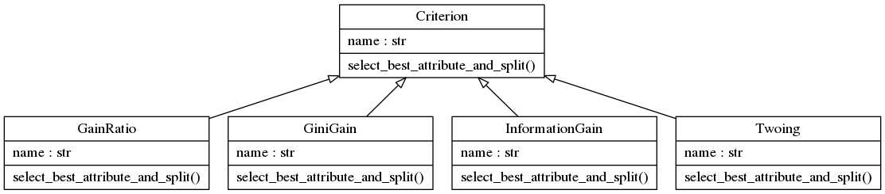
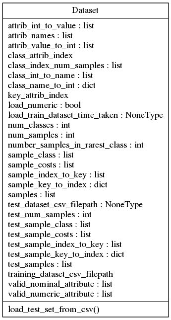
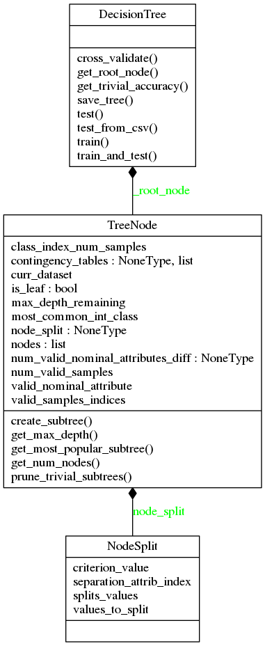

Overview
========

Decision Trees are used in many applications, ranging from ... to credit prediction. One of the main reasons of using it is a high interpretability of the outcome and a good accuracy.

The aim of this library is to allow users to load datasets and create a decision tree to classify samples with unkown classes. It includes the main splitting criteria used in the market, such as Gini Gain, Twoing and Gain Ratio. A module for loading datasets and another to run experiments with decision trees are also included.

The module was develop in Python 3.6 with the following requirements:

    * numpy 1.12.1
    * scipy 0.19.0
    * scikit-learn 0.18.1

Requirements
############

Given the objective of the library, the following software requirements specifications were layout:

1. Ready to Go
    * **Objective**: The library should include at least 3 already implemented splitting criteria for decision trees. It should also allow the user to load train and tests datasets and to train/test decision trees on them.

    * **Description**: Since the main objective of the library is to let the user train decision trees on different datasets and use its predicion on a different dataset, this is a must.

2. Reproducibility
    * **Objective**: The library should ensure reproducibility.

    * **Description**: The end user have to be able to reproduce the experiments when using the same dataset/criterion. This should be done through a dataset configuration file.

3. Performance
    * **Objective**: The library should provide mechanism for evaluating the decision trees' training and test results.

    * **Description**: The user must be able to measure the accuracy and size of the decision trees.

Architecture
############

`Object Oriented programming (OOP) <https://en.wikipedia.org/wiki/Object-oriented_programming/>`_ is a programming paradigm based on the concept of "objects", which may contain data, in the form of fields, often known as attributes; and code, in the form of procedures, often known as methods. The platform was designed using this methodology, for each requirement at least one class was conceived that addressed the issue. For instance: for requirement 1, a module containing criteria, another containing decision tree methods and another allowing to load datasets were developed. For requirement 2, each dataset has a configuration file and it is loaded through the dataset module. For requirement 3, the decision tree module has the necessary methods. The following UML diagram show the relationships between the developed classes:

    Class Diagram (in UML format)

    Class Diagram (in UML format)

    Class Diagram (in UML format)

Testing Methodology
###################

`Test Driven Development <https://en.wikipedia.org/wiki/Test-driven_development>`_ (TDD) is a software development process that relies on the repetition of a very short development cycle: requirements are turned into very specific test cases, then the software is improved to pass the new tests, only. TDD relies in unit test, simply put a unit test is an automated code-level test for a small unit of code, like a function inside a class.

The platform was developed following a TDD. The testing coverage of platform was XX% computed using the `coverage.py <https://coverage.readthedocs.io/en/coverage-4.2/>`_.
